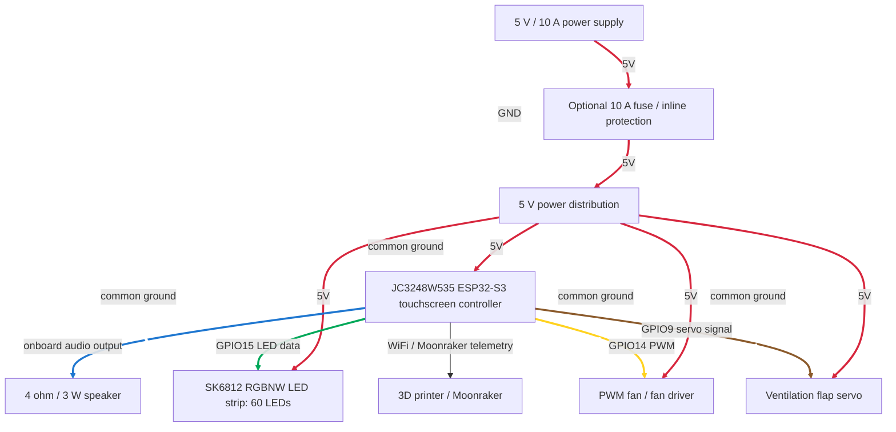

# coroNET OS 1 Assembly And Wiring Guide

This guide describes the current coroNET OS 1 hardware assembly and wiring layout for the ESP32-S3 touchscreen controller build.

Always verify the exact board revision, connector labels, polarity, and firmware pin definitions before powering the device.

---

## High-Level System Layout

Diagram color legend:

- red solid lines: `5V`
- white dashed lines: `GND` / common ground
- green line: LED data
- blue line: audio / speaker output in the diagram
- yellow line: fan PWM/control
- brown line: flap servo signal
- default lines: signal or data

---

## Firmware GPIO Map

| Function | ESP32-S3 GPIO | Notes |
| --- | ---: | --- |
| SK6812 LED data | `GPIO15` | Main RGBW LED data line |
| LED SPI dummy clock | `GPIO16` | Dummy/unconnected clock pin used by the SPI LED shim |
| Servo signal | `GPIO9` | Ventilation flap servo control |
| Fan PWM | `GPIO14` | Fan PWM or fan-driver control |
| DIY chamber heater output | `GPIO46` | Optional active-HIGH output in firmware; verify before using |

Important: LED numbers such as `42..59` describe physical LED indices, not ESP32 GPIO numbers.

---

## Power Wiring

| Connection | Wire From | Wire To | Wire color | Notes |
| --- | --- | --- | --- | --- |
| Main 5 V input | 5 V / 10 A power supply `+` | Power distribution `+5V` | Red | Use wire sized for LED and peripheral current |
| Main ground | 5 V / 10 A power supply `-` | Power distribution `GND` | White | All modules must share common ground |
| Optional fuse | Power supply `+` | Fuse input, then fuse output to distribution | Red | Optional 10 A protection; skipping it is at the builder's risk |
| ESP32-S3 power | Power distribution `+5V/GND` | Controller power input | Red + white | Use the board's intended power input |
| LED power | Power distribution `+5V/GND` | LED strip `5V/GND` | Red + white | Do not power the LED strip through thin controller traces |
| Servo power | Power distribution `+5V/GND` | Servo `VCC/GND` | Red + white | Use external 5 V power, not a weak logic pin |
| Fan power | Power distribution `+5V/GND` | Fan or fan driver | Red + white | Match the fan voltage and current rating |
| Capacitor | LED `5V` and `GND` | Near LED power input | Red to `+`, white to `-` | 1000 uF / 10 V, observe polarity |

Power safety notes:

- Verify polarity before first power-up.
- Keep LED, audio, servo, fan, and ESP32-S3 grounds connected together.
- The 10 A fuse is optional, but it is strongly recommended for safer product-style wiring.
- If using solderless DC connectors or inline wire connectors, verify current rating and mechanical retention.

Signal color guide:

| Signal | Suggested wire color |
| --- | --- |
| LED data | Green |
| Audio / speaker output | Blue |
| Fan PWM/control | Yellow |
| Flap servo signal | Brown |

---

## LED Assembly

Use one SK6812 RGBNW strip with 60 LEDs.

Firmware LED layout:

| Physical section | LED indices | Count |
| --- | --- | ---: |
| Right outer section | `0..10` | 11 |
| Center/front outer section | `11..30` | 20 |
| Left outer section | `31..41` | 11 |
| Inside section | `42..59` | 18 |

Wiring:

| LED pad | Connect to | Wire color |
| --- | --- | --- |
| `5V` | 5 V power distribution | Red |
| `GND` | Common ground | White |
| `DIN` | ESP32-S3 `GPIO15` | Green |

LED input capacitor:

| Capacitor pin | Connect to | Placement |
| --- | --- | --- |
| `+` | LED strip `5V` input | As close as possible to the first LED power input |
| `-` | LED strip `GND` input | As close as possible to the first LED power input |

Recommended capacitor: `1000 uF / 10 V` electrolytic capacitor. Observe polarity; reversed electrolytic capacitors can fail violently.

Assembly notes:

- Follow the physical LED direction expected by the firmware.
- If the unit was wired in the previous direction, enable Mirror LED mode in the LED tab.
- Keep the data wire short and away from noisy power wiring where possible.
- For a product-style build, use an SN74AHCT125N or similar 3.3 V to 5 V buffer on the LED data line, placed close to the LED input.
- If skipping the buffer, keep the data wire short and test LED stability carefully.
- Place the 1000 uF capacitor near the LED power input.

---

## Audio Assembly

The audio output is already built into the ESP32-S3 display board used by this project. The assembly only needs the external speaker.

| Speaker wire | Connect to | Wire color |
| --- | --- | --- |
| Speaker `+` | Board speaker output `+` | Red speaker wire |
| Speaker `-` | Board speaker output `-` | Black speaker wire |

Do not connect the speaker directly to ESP32-S3 GPIO pins. Use the board speaker connector/output pads.

SD card audio files:

- `boot.wav` in the SD root folder enables boot audio.
- Sound scenario files are selected from the device UI.

---

## SD Card

The microSD slot is built into the ESP32-S3 display board used by this project. Do not wire an external SD module for the standard build.

Recommended card:

- use the included 500 MB microSD card where possible
- if missing, use 500 MB to 2 GB
- avoid larger cards unless tested with the target ESP32-S3 board

Root-level files:

- `boot.wav` for startup audio
- `license.txt` for automatic activation when available
- `firmware.bin` for SD firmware update when intentionally using SD OTA

---

## Fan And Servo Assembly

### Servo

| Servo wire | Connect to | Wire color |
| --- | --- | --- |
| Signal | ESP32-S3 `GPIO9` | Brown |
| VCC | 5 V power distribution | Red |
| GND | Common ground | White |

Servo notes:

- Verify open and closed positions before installing the flap permanently.
- Do not let the servo force the flap against a hard stop for long periods.
- If the servo causes brownouts, improve 5 V power distribution and grounding.

### Fan

Recommended fan: Noctua NF-A4x10 5 V PWM or a suitable 5 V PWM replacement.

| Fan / driver signal | Connect to | Wire color |
| --- | --- | --- |
| PWM / control | ESP32-S3 `GPIO14` | Yellow |
| VCC | Fan-rated power supply | Red |
| GND | Common ground | White |

Fan notes:

- If using a 2-wire fan, do not drive it directly from an ESP32-S3 GPIO. Use a MOSFET/transistor fan driver.
- If using a 4-wire PWM fan, connect PWM to `GPIO14` and keep fan power on the correct voltage rail.
- Verify fan direction and minimum reliable PWM value in the ventilation page.

---

## Optional DIY Chamber Heater Output

Firmware currently defines the DIY chamber heater output as:

| Function | ESP32-S3 GPIO | Behavior |
| --- | ---: | --- |
| DIY chamber heater output | `GPIO46` | Active HIGH output |

Use this only through a relay module, transistor, optocoupler, or another proper driver stage. Do not power a heater directly from an ESP32-S3 pin.

Implementation note: older UI text may mention `GPIO18`; verify the final firmware definition before wiring this optional output.

---

## Mechanical Assembly Order

1. Print the mechanical parts from [coroNET.3mf](https://github.com/AlphaStudioDE/coroNET_OS_1/raw/main/coroNET.3mf), or use the optional [Alternative Magnetic Enclosure](mods/alternative-magnetic-enclosure) mod by **@wlodeka** on Discord.
2. Test-fit the ESP32-S3 display, speaker, fan, flap, and LED diffuser before soldering final wire lengths.
3. Mount threaded inserts, spacers, or screws as required by the printed parts.
4. Install the LED strip and verify its physical direction.
5. Install the display/controller board.
6. Install the speaker and connect it to the onboard audio output.
7. Install the fan, servo, and flap mechanism.
8. Route power wiring separately from sensitive signal wiring where possible.
9. Add the LED input capacitor and optional 10 A fuse.
10. Check all grounds are common.
11. Power up first with current-limited supply if available.

---

## First Power-Up Checklist

Before connecting full power:

- verify 5 V and GND polarity
- verify no short between 5 V and GND
- verify LED `DIN` goes to `GPIO15`
- verify the speaker is connected to the onboard speaker output, not directly to GPIO pins
- verify servo signal goes to `GPIO9`
- verify fan PWM/control goes to `GPIO14`
- verify the SD card is inserted and readable
- verify no high-current load is powered through an ESP32-S3 GPIO

After boot:

- confirm the boot screen appears
- confirm the boot LED animation starts
- confirm boot audio if `boot.wav` is present
- activate the device if the activation screen appears
- test LED layout and Mirror LED mode if needed
- test fan minimum and maximum PWM
- test servo open and closed positions
- test printer connection and OTA only with stable power

---

## Simplified Wiring Summary

| Module | Power | Ground | Signal pins |
| --- | --- | --- | --- |
| SK6812 LEDs | 5 V distribution | Common GND | `GPIO15` LED data, green wire |
| Speaker | Board speaker output | Board speaker output | Red speaker wire to `+`, black speaker wire to `-`; no direct GPIO connection |
| Servo | 5 V distribution | Common GND | `GPIO9`, brown signal wire |
| Fan / fan driver | Fan-rated supply | Common GND | `GPIO14` PWM/control, yellow wire |
| Optional heater driver | External driver supply | Common GND | `GPIO46` active HIGH |
