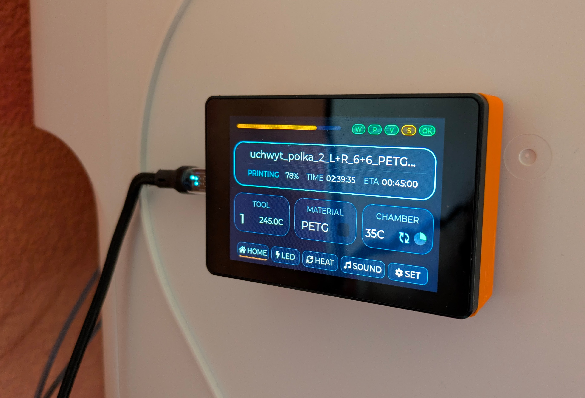
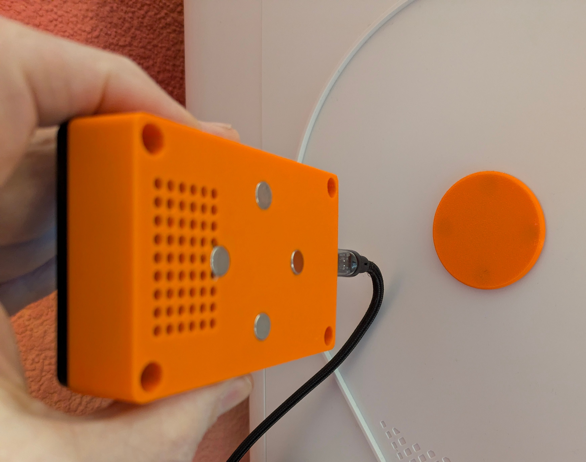
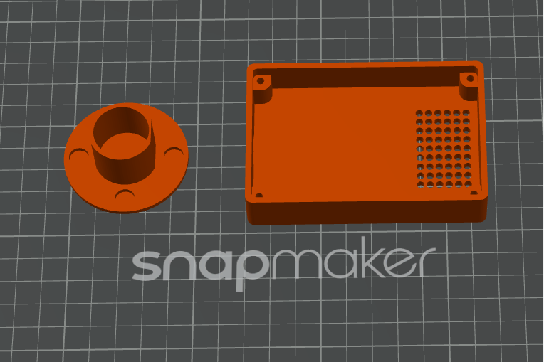

# Alternative Magnetic Enclosure

Community mod by **@wlodeka** on Discord.

This is an alternative enclosure for the coroNET OS 1 status bar/controller display. It uses a magnetic mounting concept, so the device can be attached and removed more easily than with a fixed mount.

This mod is optional and is not required for the standard coroNET OS 1 build.

---

## Included Files

| File | Purpose |
| --- | --- |
| [esp_status_bar_enclosure_A.stl](esp_status_bar_enclosure_A.stl) | Main ESP/status bar enclosure |
| [magnetic_mount_cover_A.stl](magnetic_mount_cover_A.stl) | Magnetic wall/mounting plug or cover |
| [slicer_preview.png](slicer_preview.png) | Slicer preview of the printed parts |
| [photo_front_mounted.jpg](photo_front_mounted.jpg) | Example front view after mounting |
| [photo_back_magnets.jpg](photo_back_magnets.jpg) | Example rear/magnet view |

---

## Preview

---

## Notes

- Verify magnet size, polarity, strength, and installation depth before final assembly.
- Make sure the enclosure is held securely enough for cable tension and daily use.
- Keep magnets away from loose metal debris during assembly.
- This is a community/tester mod and may require small fit adjustments depending on printer calibration, material shrinkage, and hardware revision.

Thanks to **@wlodeka** on Discord for designing and sharing this magnetic enclosure mod.
